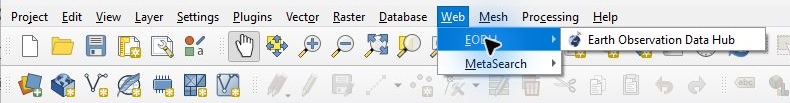
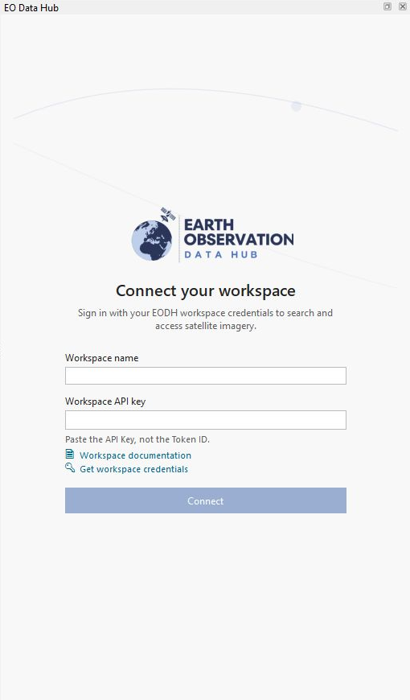
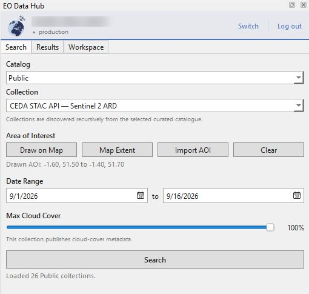
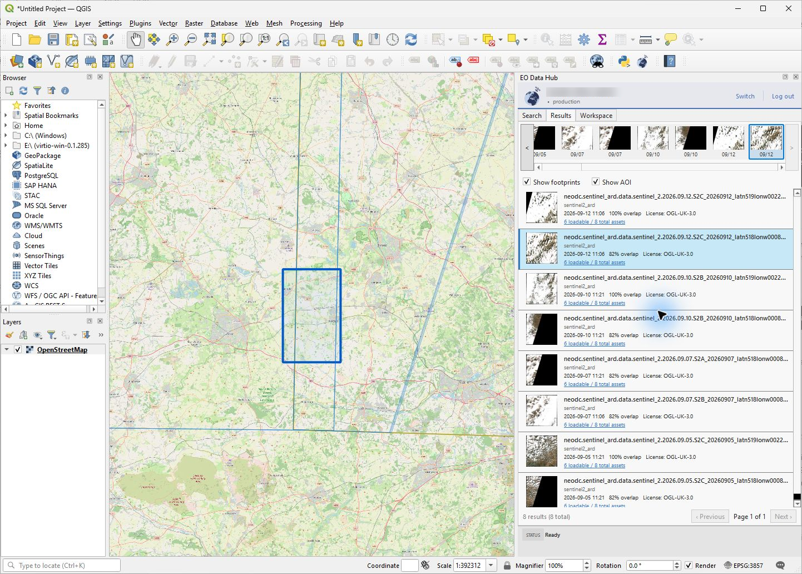
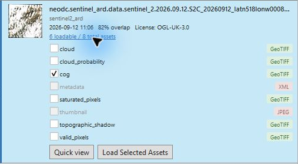
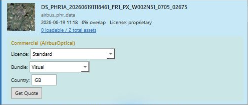
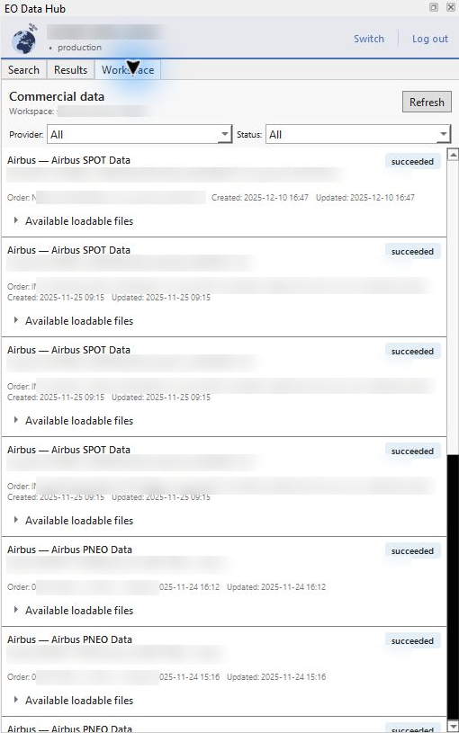

# EODH Plugin for QGIS — Usage Guide

The EODH plugin brings the [Earth Observation Data Hub](https://eodatahub.org.uk) into QGIS. It supports curated dataset search, temporary result footprints, loading supported assets, commercial quotes and orders, and commercial order records for one authenticated workspace.

## Requirements

- QGIS 3.44 LTR or QGIS 4 on a supported desktop system
- An EODH workspace and a current Workspace API key
- An internet connection for catalogue search and remote imagery

Workspace API keys expire after at most 30 days. The plugin does not renew them automatically. The screenshots below were captured in QGIS 4; the same plugin screens are available in QGIS 3.44 LTR.

## Installation

1. Download the plugin ZIP from [GitHub Releases](https://github.com/EO-DataHub/eodh-qgis/releases).
2. In QGIS, open **Plugins → Manage and Install Plugins… → Install from ZIP**.
3. Select the ZIP and choose **Install Plugin**. The plugin is listed as **Access and run workflows on the EODH**.
4. Review and install the dependencies requested by qpip, as explained below. Restart QGIS if prompted.

You can also install the published plugin from the **All** tab in the plugin manager. Open the plugin using its toolbar button or **Web → EODH → Earth Observation Data Hub**.

### What is qpip?

**qpip** is a separate QGIS plugin that installs Python packages required by other plugins. It reads this plugin's `requirements.txt`, asks before installing missing packages, and installs them in the active QGIS profile's `python/dependencies` directory. Each profile has its own dependencies. See the [qpip end-user documentation](https://github.com/opengisch/qpip#usage-end-user).

This plugin requests:

| Package | Purpose |
|---|---|
| `defusedxml` | Safer XML parsing for data utilities. |
| `pyeodh` | The EODH Python client used by the plugin's API/data utility modules. |
| `truststore` | Uses the operating system's trusted certificate store for HTTPS connections. |

Review qpip's full package list before agreeing: it can include dependencies of these packages. This agreement installs software; it does not purchase imagery or create an EODH subscription. If you decline, features requiring the missing packages may be unavailable. QGIS supplies Qt, GDAL and its Python bindings; do not install a separate PyQt wheel into QGIS.

## Signing in

1. Open the EODH dock from the toolbar or Web menu.
2. Enter the **Workspace name**.
3. Paste the **Workspace API key** — use the API Key, not the Token ID.
4. Select **Connect**. The plugin always connects to Production.

Credentials are automatically saved in QGIS's encrypted authentication manager. QGIS may ask you to unlock or configure its authentication database. If it cannot save the key, the plugin reports that the credentials are available for this session only. If a saved key is invalid or expired, the plugin returns to sign-in with the service error. Create or copy a current key from the [EODH workspace credentials page](https://docs.eodatahub.org.uk/Getting-Started/workspaces/workspace-credentials/).

**Workspace documentation** opens the credentials guide; **Get workspace credentials** opens the portal for the workspace entered in the form. Select **Log out** or **Switch** in the dock header to clear saved EODH credentials, results and temporary overlays and return to sign-in. API keys are not written into QGIS projects or raster source URLs.

## Searching for data

### Select a catalogue and collection

Search exposes exactly two curated roots:

- **Public**
- **Commercial**

The plugin discovers descendant catalogues and collections at runtime. Collections appear as a flat, sorted list labelled **Provider — Collection**. Type in the collection picker to find a collection. Workspace, user, and internal processing catalogues are not included.

### Define an area of interest

| Method | Description |
|---|---|
| **Draw on Map** | Drag a rectangle on the map. |
| **Map Extent** | Use the current map view as the bounding box. |
| **Import AOI** | Import a GeoJSON/JSON polygon, shapefile or GeoPackage. |
| **Clear** | Remove the current area of interest. |

Selecting a collection applies its published spatial extent when available. Replace it with the area you want to search. Imported vector extents are transformed to WGS84 and combined into one bounding box without adding the file to the map. The current bounding box is used for search and, where supported, commercial quote/order coordinates. Search requires a collection and an area. Split areas crossing the antimeridian into separate searches.

To use a basemap, add an XYZ connection in QGIS's Browser panel and drag it onto the map. For example, create an **OpenStreetMap** connection with the URL `https://tile.openstreetmap.org/{z}/{x}/{y}.png`, then zoom to your area before choosing **Map Extent**.

### Set dates and cloud cover

The date range follows the selected collection's published temporal extent. An open end defaults to today; a missing start defaults to one month ago. Adjust the dates to your search period; the end date includes the whole day.

**Max Cloud Cover** appears for collections that publish cloud-cover metadata. Set it below 100% to add a cloud predicate; 100% sends no cloud predicate.

Select **Search** to open the current result page. If collection discovery fails, switch catalogue groups and back to retry.

## Browsing results and footprints

The Results tab contains a synchronized timeline and results list. Selecting an item in either view selects it in the other. The timeline initially selects the newest dated scene. Its arrows step through dated scenes; **‹ Previous** and **Next ›** navigate result pages. A page error retains the current results.

**Show footprints** is enabled by default. Valid Polygon or MultiPolygon geometries on the current result page appear as temporary blue outlines, with the selected item highlighted in gold. Turning the option off, starting a new search, signing out, clearing results, or closing the dock removes the footprints. They do not create project layers. **Show AOI** separately controls the area-of-interest overlay.

Basemap © [OpenStreetMap contributors](https://www.openstreetmap.org/copyright).

Each result can show its thumbnail, item and collection identifiers, acquisition time, resolution, cloud cover, AOI overlap, locational accuracy, licence, and assets. AOI overlap is a planar WGS84 approximation; items with zero bounding-box overlap are excluded from the displayed page and counted in its summary.

Select **N loadable / N total assets** to expand a result. Check supported COG, GeoTIFF, or NetCDF assets and choose **Load Selected Assets**, or double-click a result with selected assets. Metadata and thumbnail files remain visible but cannot be loaded as rasters.

COG and GeoTIFF assets stream using HTTP byte-range requests: QGIS reads overview pixels when zoomed out and higher-resolution blocks as you zoom in or pan. If streaming is unavailable, the plugin automatically downloads the complete file and loads it, showing download progress. Untiled files or files without overviews can require more data. NetCDF assets download before loading.

Streamed layers need an internet connection. After reopening a project with protected EODH layers, connect to the same workspace to restore access. Authentication covers the EODH API and the selected workspace's storage host, including delivered Airbus assets. Downloaded files are temporary; copy data needed by a long-lived project to durable storage and update the layer source accordingly.

**Quick view** is available when the collection has a supported render configuration and the item contains the required assets. It adds the default TiTiler rendering as an XYZ map layer. Protected Quick view layers reference QGIS's encrypted authentication configuration, rather than storing the key in the project.

## Commercial quotes and orders

Commercial controls depend on the detected provider:

| Provider | Licence | Product bundles | Additional fields |
|---|---|---|---|
| Airbus Optical | Required; nine provider options | Visual, General Use, Basic, Analytic | End-user country |
| Airbus SAR | Required; three provider options | SSC, MGD, GEC, EEC | Orbit; resolution except SSC; projection except SSC/MGD |
| Planet | No licence picker | Visual, General Use, Basic, Analytic | None |
| Open Cosmos | No licence picker | No bundle picker | AOI, when supplied |

To purchase:

1. Complete every visible provider field.
2. Select **Get Quote** and review the returned value, units, and message.
3. Review **Provider account and licensing guidance** and the applicable terms.
4. Select **Purchase** and approve the final **EODH — Confirm Order** dialog. The dialog states the quoted price and explains that the action is irreversible; **No** is the default.

A quote belongs to the exact item, AOI bounding box, provider, licence, bundle, country, and radar options used to obtain it. Changing any applicable input clears the quote and disables ordering until a new quote succeeds. Each result card keeps its own quote. A successful submission displays **Ordered — check workspace for delivery status**. After an order error, check Workspace before retrying: the backend may have accepted an order before a network failure.

If EODH reports that provider credentials are missing, link the Airbus or Planet account in Workspace settings. See [linked accounts guidance](https://docs.eodatahub.org.uk/Getting-Started/workspaces/linked-accounts/).

## Workspace commercial data

The Workspace tab displays commercial records for the signed-in workspace only. It does not include members, workflow jobs, workflow outputs, or a raw object-store browser.

Use the **Provider:** and **Status:** filters to review pending, processing, failed, and completed records. Backend messages, order identifiers, and timestamps are shown when available. Only delivered records with supported assets expose **Available loadable files** and **Load into map**. Expand a record, select its files, and load them. Filtering retains asset selections and expanded cards. Use **Refresh** for delivery updates or **Retry** after a reported error.
